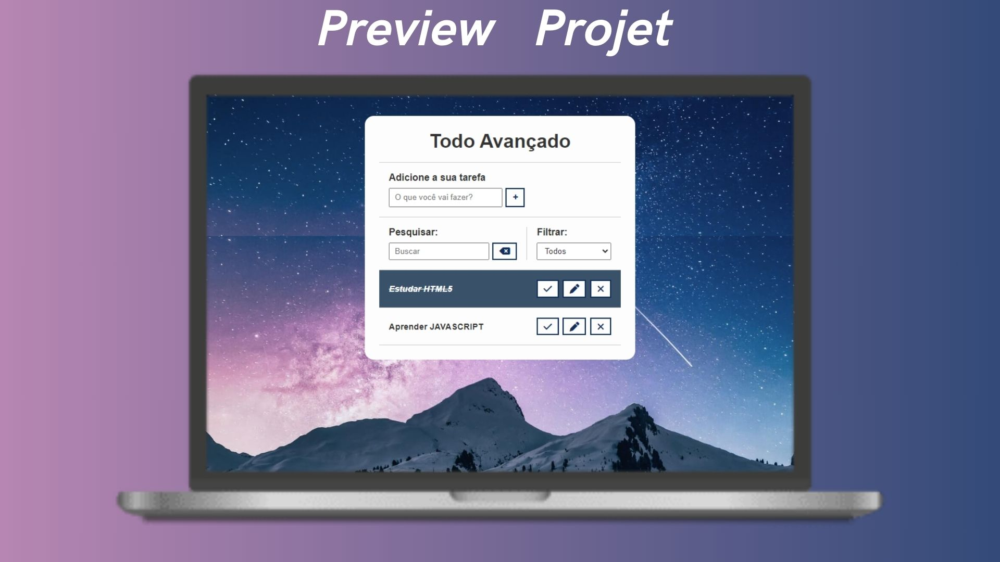

# Lista de Tarefas Js 📋🆕

To do List desenvolvido com HTML, CSS e JAVASCRIPT.

## 🔥 Introdução
Este projeto foi feito toda estrutura e estilo com HTML e CSS, e com o JAVASCRIPT demos as devidas funcionalidades da lista de tarefas.

Neste projetos usamos boas práticas de desenvolvimento.✔️

Neste projeto utilizamos conceitos bastante importantes de JS como manipulação de elementos com o DOM, Arrow functions, e eventos.

Projeto simples mas que exercita muito bem a base do desenvolvimento Web.

### 📦 Tecnologias usadas

* 
* 
* 

